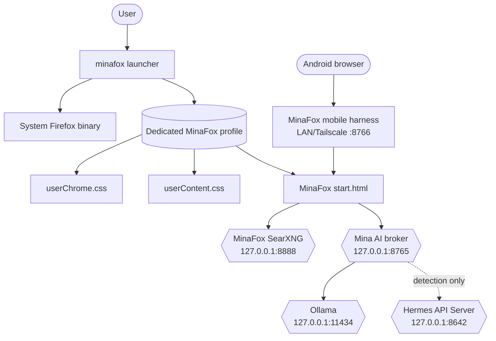
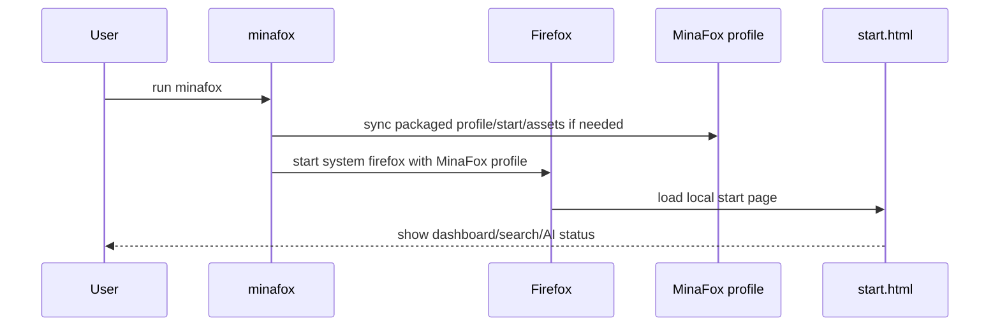
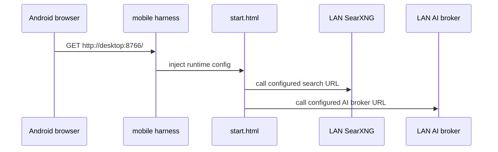

# Architecture

MinaFox is intentionally split into wrapper assets, local services, and optional development harnesses. The current phase avoids modifying or distributing Firefox itself.

## High-level system

## Components

- **Launcher** — `scripts/minafox-launcher.sh` wraps the system Firefox binary and ensures user-local assets are present.
- **Profile assets** — `profile/user.js`, `profile/userChrome.css`, and `profile/userContent.css` define prefs and UI styling.
- **Start page** — `desktop/start.html` is a static, local page with search, quick links, AI Den status, and service controls.
- **SearXNG overlay** — `searxng/` contains a local SearXNG container overlay bound to `127.0.0.1:8888`.
- **AI broker** — `scripts/minafox-ai-broker.py` exposes localhost discovery and local Ollama chat when explicitly enabled.
- **Android harness** — `scripts/serve-minafox-mobile.py` serves the start page and injects LAN service URLs for phone testing.
- **Package skeleton** — `packaging/arch/minafox-profile-git/` packages the wrapper without replacing Firefox.
- **User services** — `systemd/user/` contains optional service units for search, AI, and mobile harness.

## Desktop launch

## Android test mode

## Design decisions

- Use the distro Firefox binary until the wrapper/package is reliable.
- Keep secrets out of static browser assets.
- Bind services to loopback by default unless LAN testing is explicit.
- Keep Android testing as a web harness instead of early Fenix/APK work.
- Make visual polish testable with validators, not just manual screenshots.
